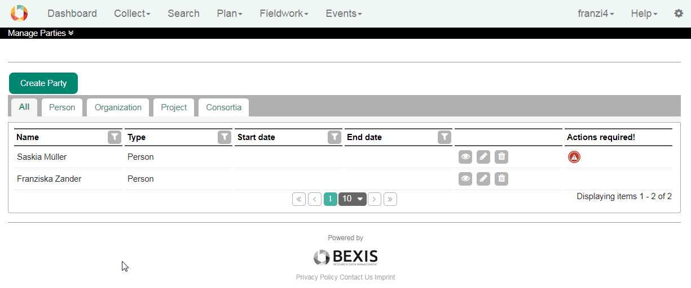
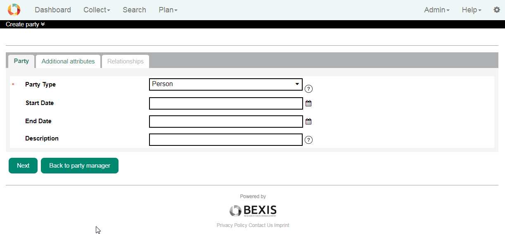

# Party Administration (v2.13)

<!-- TOC --> 
- [A: Overview](#a-overview)

- [B: Manual for users](#b-manual-for-users)

	- [1 Registration](#1-registration)
	- [2 Login](#2-login)
	- [3 Dataset permissions](#3-dataset-permissions)
	- [4 API Token](#4-api-token)
	
- [C: Manual for administrators](#c-manual-for-administrators) 

	- [1 XML-Schema](#1-xml-schema)
		- [1.1 PartyType attributes](#11-partytype-attributes)
		- [1.2 Custom attributes](#12-custom-attributes)
		- [1.3 PartyRelationshipType attributes](#13-partyrelationshiptype-attributes)
  		- [1.4 PartyTypePair attributes](#14-partytypepair-attributes)
 	- [2 Manage parties](#2-manage-parties)
 		- [2.1 Create and Edit](#21-create-and-edit)
 		- [2.1 Delete](#21-delete)
 	- [3 Manage Relationships](#3-manage-relationships)
 		- [3.1 Create](#31-create)
 		- [3.2 Edit and view a relationship](#32-edit-and-view-a-relationship)
 		- [3.3 Delete a relationship](#33-delete-a-relationship)
 	- [4 Account registration](#4-account-registration)
 	- [5 Configuration](#5-configutation)
		- [5.1 PartyRelationships](#51-partyrelationships)
		- [5.2 Link user email to party email](#52-link-user-email-to-party-email)
 
<!-- /TOC --> 
 
## A: Overview

Party package is managing all kinds of entities such as people, organizations, projects and etc. it is also managing the relationship between them. For example, one person is a part of a project for a certain duration. Furthermore, it is able to connect to the other modules which now it is connected to the security module and also it is able to import the definitions such as “partytypes”, “customattributes” and “relationshiptype” from an XML file.

## B: Manual for users

### 1 Manage profile data
...

## C: Manual for administrators

### 1 XML-Schema

The schema is defined in the file *PartyTypes.xml* which is located in the workspace under *…\Workspace\Modules\BAM*. 
Here you can define the *party types* and their *custom attributes* together with *relationship types*.

**[ ]** optional attributes
 
#### 1.1 PartyType attributes

|         |           |
| ------- |:--------| 
| **Name:** | Party type name should be unique among the other party types. Spaces and special characters should be avoided.
| **[DisplayName]** | Name shown in the UI. If not set, the **Name** is used, which might be not very user-friendly.

#### 1.2 Custom attributes
Each party type can have custom attributes.

|         |           |
| ------- |:--------| 
| **Name:** | Name of the custom attribute.
| **[DisplayName]** | *default*: **Name**. Name shown in the UI. If not set, the **Name** is used, which might be not very user-friendly.
| **[Type]** | *default*: "string". Option: "bool" (two radio buttons with true/false).
| **[IsMain]** | *default*: "false". Every party should have a general name, which comes from its custom attributes. If there is more than one “IsMain” attribute it will be merged by a space. 
| **[ValidValues]** | List of values shown as dropdownlist. Values should be separated by “,”.
| **[IsUnique]** | *default*: "false". "true" means that this attribute of this party should be unique among the other parties which have the same party type. 
| **[IsValueOptional]** |  *default*: "true".  "false" means the user has to fill this field.
| **[Description]** | Shows some extra information as a tooltip to user.

  
#### 1.3 PartyRelationshipType attributes

|         |         |
| ------- |:--------| 
| **Name** | PartyrelationshipType name should be unique among the others. Spaces and special characters should be avoided.
| **[DisplayName]** | Name shown in the UI. If not set, the **Name** is used, which might be not very user-friendly.
| **[Description]** | Shows some extra information as a tooltip to user.
| **[IndicatesHierarchy]** | *default*: "false". "true" means that there is a hierarchy relationship between all the pairs as the source is root and target is the child of it.
| **[MaxCardinality]** | *default*: unlimited. If it is set to a number it forces the user to not have more than this number relationships.
| **[MinCardinality]** | *default*: unlimited. If it is set to a number it forces the user to have at least this number of relationships.

#### 1.4 PartyTypePair attributes

|         |         |
| ------- |:--------| 
| **Title**  | The title of this pair.
| **AllowedSource** | source party type is obligatory and should be exactly the same name as we defined for partytype.
| **AllowedTarget** | Target party type is obligatory and should be exactly the same name as we defined for partytype.
| **[Description]** | It shows some info about this type to user in a tooltip.



### 2 Manage parties
An administrator can see, create, edit and delete parties. A normal user may have limited permissions.

On the overview page, you can see all the available entities and manage them. The red warning icon in the "action-required" column shows that this party needs some relationships to be valid.


 
#### 2.1 Create and Edit
A new party can be created under *Settings > Manage Parties > Create Party*. In the first step, you should select a party type and its date range, if applicable. Click on Next to continue. 

In the next step, you will see some additional attributes based on the selected party type. Required fields are marked with a red asterisk. Click on Save or on Next to continue
 
Some party types, you have to create relationships with other party types (e.g. a person belongs to an organization). If you do not do it, the party will be saved, but it is not valid. You can also add a relationship  later.
 
To edit a party click on "Edit" in the party overview. You can change all the fields except for the party type.



#### 2.1 Delete
Only parties not in use or linked can be deleted under *Settings > Manage Parties*.
 
### 3 Manage Relationships
#### 3.1 Create
Every party could have relationships with the other parties. Party relationships tab in edit or create party is to manage these relationships. 
  To create a new relationship, click on create and you see the following window. Here you see all the available party relationship types depend on the definitions, which we already defined. The numbers in parentheses shows the number of current relationships and the maximum relationships that this party to this relationship type can have. 

 
Clicking on one of them, you see some more options and available parties to make relationship. 
 
Selecting a party, it asks you to enter some information and by default, it fills some of the fields. Title here is the title of this relationship, start and end date are important and will set the duration of this relationship. This duration should be fit to the duration of source party and the target party otherwise, you will face to an error.
 
You will face to this error if there is no party or party relationship type defined.
 

#### 3.2 Edit and view a relationship
Clicking on edit icon (pencil figure) on last column of each relationships, you are able to edit the relationship. Moreover, clicking on the view icon (eye figure), you are able to see the detail of a relationship.
 
 
 

#### 3.3 Delete a relationship
Clicking on delete icon (trash figure) on last column of each relationships, you are able to delete a relationship if the minimum cardinality of its relationship type preserved.
 


## 4 Account registration

After creating an account, other information of user will save in party package . Before using this page we shoud set some configuration to clear the allowed party types which are related to the account and also the relationships which you want to ask user in registration page.
 
## 5 Configuration
### 5.1 PartyRelationships
		
Party types related to the account should be defined in setting.xml, which you can find it in BAM workspace folder. A comma should separate party types and each of them could have zero or multi allowed relationship. If the relationship type has one ‘partytypepair’, the registration page will populate all the parties, which has the same party type as this type pair. If the relationship type has more than one 'partytypepair', it will populate the allowed target of the 'partytypepair' which has "partyrelationshiptypedefault==true" this attribute and if it doesn’t have this attribute it will use the first party type pair by default.

```
Example: 
PartyType1:PartyRelationshipTypeTitle1-PartyRelationshipTypeTitle2, PartyType2
```
 
### 5.2 Link user email to party email

To activate the linkage between between user email and a party email set in the global *Web.config* *usePersonEmailAttributeName* true and define the party party attribute. If one of the email addresses is changed the other is changed as well.
```
<add key="usePersonEmailAttributeName" value ="true"/>
<add key="PersonEmailAttributeName" value ="Email"/>
```

