# Data Collection: Metadata and Data (v2.13)


<!-- TOC -->

- [A: Overview](#a-overview)

- [B: Manual for users](#b-manual-for-users)

	- [1 Create Dataset](#1-create-dataset)
		- [1.1 Metadata](#11-metadata)
		- [1.2 Dataset links](#12-dataset-links)
	
	- [2 Upload Data](#2-upload-data)
		- [2.1 Upload Tabular Data](#21-upload-tabular-data)
		- [2.2 Upload File](#22-upload-file)
		
	- [3 Import Data](#3-import-data)
	
	- [4 Push Big File](#4-push-big-file)

- [C: Manual for administrators](#c-manual-for-administrators)
	- [1 Manage Metadata Structure](#1-manage-metadata-structure)
		- [1.1. Select File](#11-select-file)
		- [1.2. Read Source](#12-read-source)
		- [1.3. Set Parameters](#13-set-parameters)
		- [1.4. Summary](#14-summary)
	- [2 Configure dataset links](#2-configure-dataset-links)	

<!-- /TOC -->

## A: Overview

The *Data Collection Module* provides tools to create new datasets consisting of metadata and data. The metadata is based on a schema defined by a metadata structure. The primary data can be tabular (structured) or files. They are described by a data structure which either describes the variables and units of tabular data or the type of files. The module provides functions and workflows to create new metadata and upload files or import tabular data. 

## B: Manual for users
### 1 Create Dataset

This wizard will assist you in creating a new dataset in BEXIS2. The Wizard is very flexible and builds up differently depending on the selected Metadata structure. Therefore, we describe only the basic functions here.

The first step is to generate an empty or a copy of an existing dataset based on your selection of the two mandatory elements: Data Structure, and Metadata Structure.

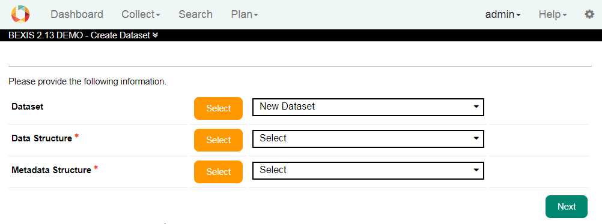 

The next stage is determined by the selected metadata structure.

##### Copy an existing Dataset

By choosing an existing Dataset instead of creating a new one, you are able to make a copy of that dataset. Related to the Dataset, you can choose a Data Structure, but there is only one related Metadata Structure for each dataset.

You are able to use predefined content or change fields as you want.

#### 1.1 Metadata

The content area is where you enter metadata describing your dataset. The forms provided here may look different and contain different attributes depending on the metadata schema (structure) you have chosen in the first step.

           Required attributes

        Add an attribute

        Remove an attribute

  Change order of the attribute

      Expand / collapse

   	Show help information. The button on the right top hides / shows all help information. 

 

On the bottom of the page, there is a button titled Validate to examine whether required attributes have been filled and values fit to the expected data format. 

You could edit a submitted dataset or make a copy of that by clicking on the Edit or Copy buttons.

When an input is wrong or missing, the input field is highlighted in red. 

#### 1.2 Dataset links
It is possible to create relations between different datasets of one type or different types of datasets (e.g. dataset and publication). Links always refer to a specific version of a dataset. Dataset links are shown under *Links* and divided into *Links to* the dataset and *Links from* the dataset. This shows the direction of the link and clearly defines what is source and target, which might be relevant related to the type of the selected reference (e.g. parent, child ...). 

There are two options to create relations / links between datasets:

##### Link via Metadata
Fields in the metadata form can contain lists of datasets stored within the system. If one is selected also a link in both directions based on the most current versions is created.

##### Direct links
Links can also be created directly under *Link > Create link*. Here you can also choose  which version you like to refer to and what kind of link it is. In addition, you can also give more details to it.

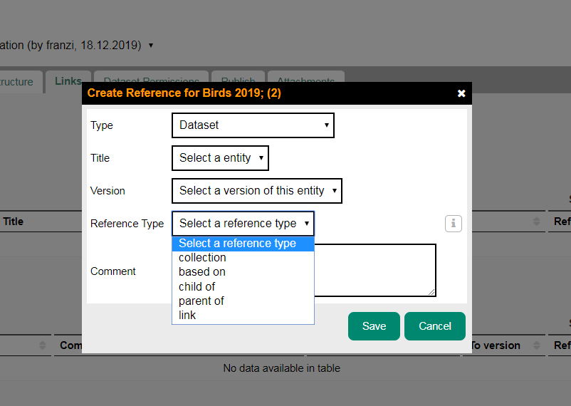 

### 2 Upload data

To upload your data, please go to the *Collect > Upload Data* via main menu. This wizard will assist you in uploading data into the BEXIS2 repository. A dataset can be structured or unstructured (i.e tabular or file).

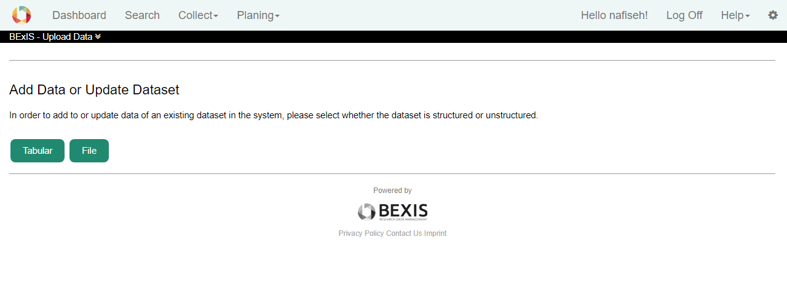 

#### 2.1. Upload Tabular Data

The term "Tabular data" is used for all datasets where there internal structure of the data is "known" to the system. For example, in a data table the header, which defines the columns (i.e. variables) is the structure of the data. Before uploading/importing data to the system the data structure needs to be created through the Data Structure Manager.

Uploading a tabular data follows the following steps.

##### Select File

In the first step an existing file containing your data needs to be selected. You can either select a file from your local computer or a file that has been uploaded to the server prior to starting the Upload Wizard. The second option is designed for files larger than 4 MB that may take several minutes to transfer. The wizard supports file formats of Microsoft Excel or ASCII. Microsoft Excel files are required to use a template created while creating a Data Structure (refer to [Data Planning User Guide](~/rpm/Help/index#_overview) for more details). Once a file has been successfully selected, click the Next button and proceed to the next step.

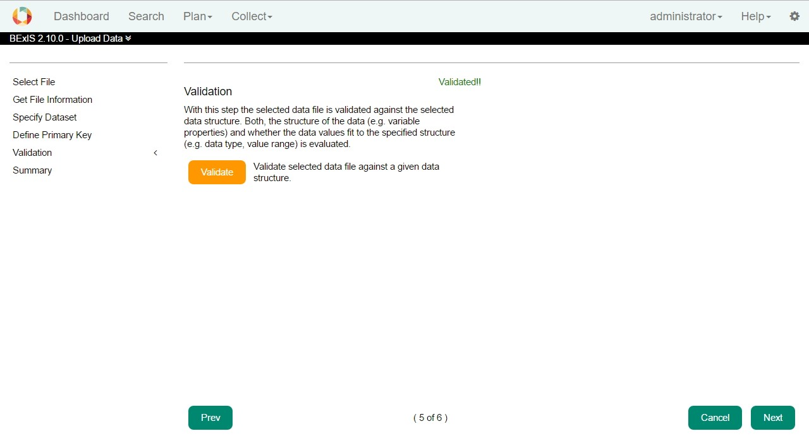 

##### Get File Information

For all Microsoft Excel files using a BEXIS2 template the file information and data structure is automatically extracted and this step is omitted. Please refer to the [Data Planning User Guide](~/rpm/Help/index#_overview) for more details on how to create such a template.

For all other Excel files, users need to provide the information by selection the data on the screen.

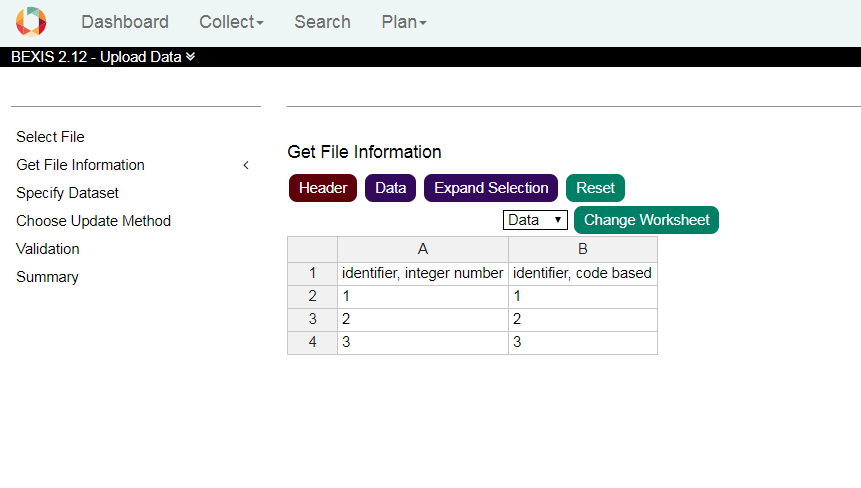 

For all ASCII files users need to provide information on the file structure and formatting.

First, please choose a separator that is being used to separate data values from each other in your ASCII file.

Depending on your language different punctuation is used for decimal values. Please choose the one present in your ASCII file.

Next please specify whether the orientation of your data is column-wise or row-wise (see figure below).

Datasets may contain empty rows or columns on top or to the left before the header and the actual data values start. Please specify this offset in number of columns or rows. 

Further, your data file may contain a header defining variable names, types etc. The row/column where this header starts needs to be specified (see figure below).

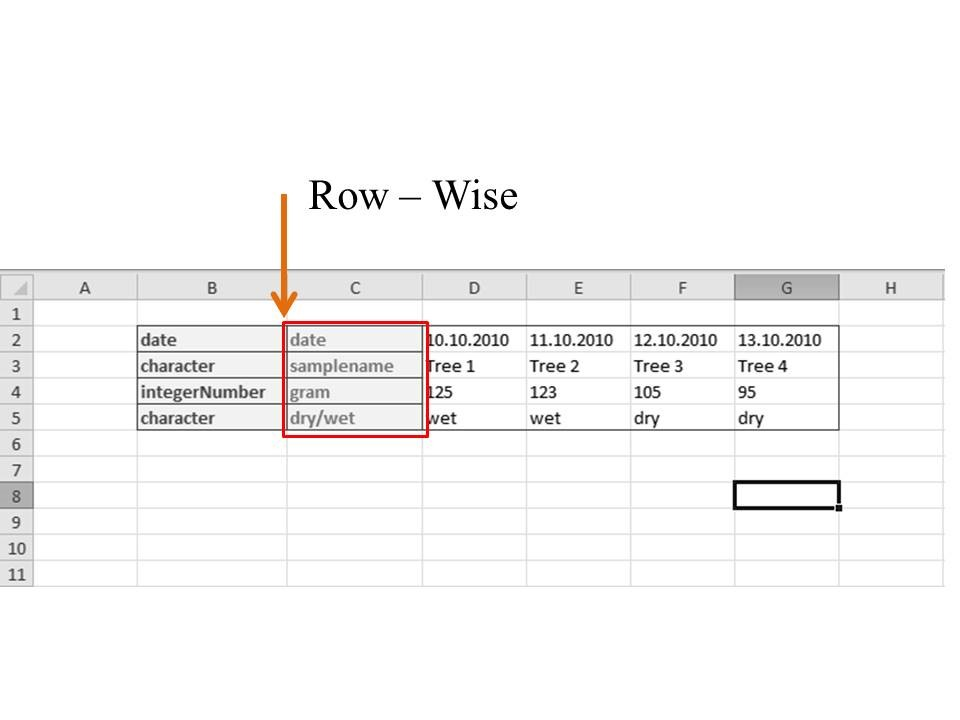 

Finally, the row/column where the actual data values start needs to be specified.

##### Specify Dataset

In BEXIS2 your data is stored and managed as part of a dataset. A dataset may contain one or more of your data files. But all data files within one dataset must be of the same data structure, i.e. the number of variables and their properties must be identical in each file. To upload your data to the system, please select one existing dataset from the dropdown list.

##### Choose Update Method

While adding data to an existing dataset you need to specify how you want to update.

By Update the user need to specify a unique identifier (e.g. primary key) for each tuple (i.e. row) in your dataset. If your dataset already contains a variable with such a key, please select it. Otherwise, a primary key can be created by combining available variables. Please click the Check button to verify whether the selected combination is unique. If you go back and change something in the process of uploading, you need to check the primary key again.

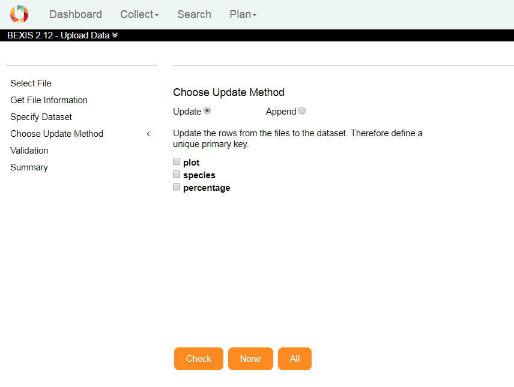 

By Append, the lines are uploaded directly to the data without checking for duplication.

##### Validation

With this step, the selected data file is validated against the selected data structure. Both, the structure of the data (e.g. variable properties) and whether the data values fit to the specified structure (e.g. data type, value range) is evaluated.

Click on Validate button to validate the data file.

If you go back and change something in the process of uploading, you need to validate the file again.

##### Summary

With this final step a summary of your uploaded data file is provided. Please check the information and click the Finish button to confirm and finalize the upload.

#### 2.2 Upload File

An unstructured data could be either selected from your local computer or could be a file that has been uploaded to the server. In the case of unstructured data, we do not read the contents of the data. We copy the files to the server and place them in relation to the dataset.

BEXIS2 application can support many file formats which are referred on the relevant page.

The Maximum acceptable file size up to now is: 1024 MB.

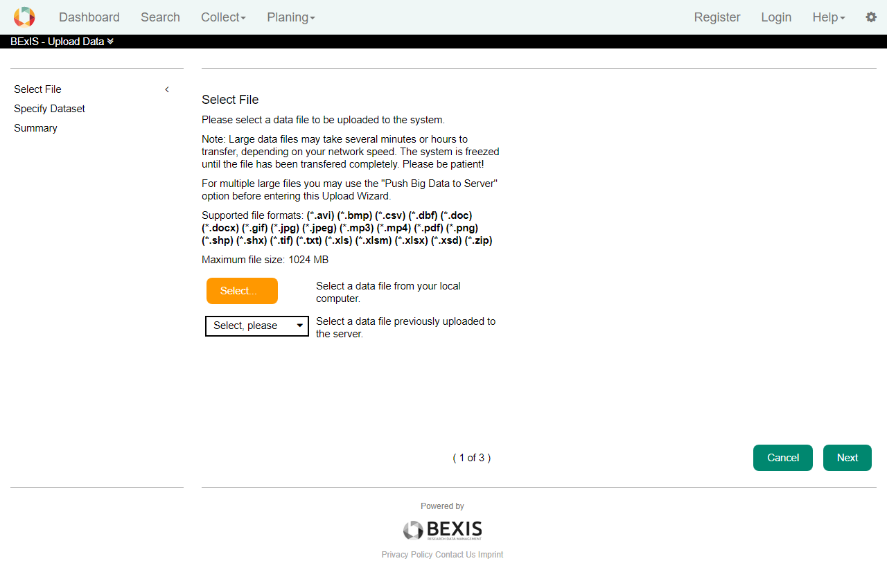

### 3 Import Data

The Import Data wizard enables you to import both a tabular data structure and data in a single workflow. Import a file follows the following steps.

#### 3.1 Select File

In the first step an existing file containing both your data and the names of the variables needs to be selected. You can either select a file from your local computer or a file that has been uploaded to the server prior to starting the Upload Wizard. The second option is designed for files larger than 4 MB that may take several minutes to transfer. The wizard supports file formats of Microsoft Excel (*.xlsm, *.xlsx). Once a file has been successfully selected, click the Next button to proceed to the next step.

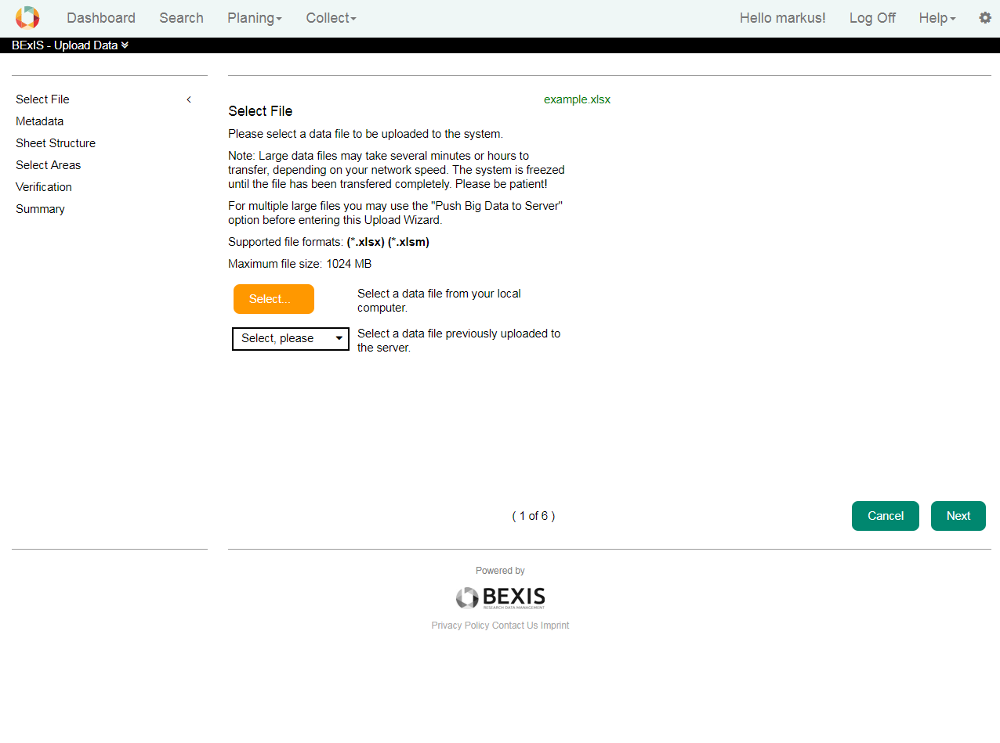

#### 3.2 Metadata

This step allows you to select the metadata schema that you would like to use for the dataset. There is no need to enter any metadata yet - after the last step you will be redirected to a page that allows you to enter the metadata. You can, however, change the title of the dataset. If you don't wish to change it, it will default to the name of the file you are using. Once you have selected a schema, click the Next button to proceed to the next step.

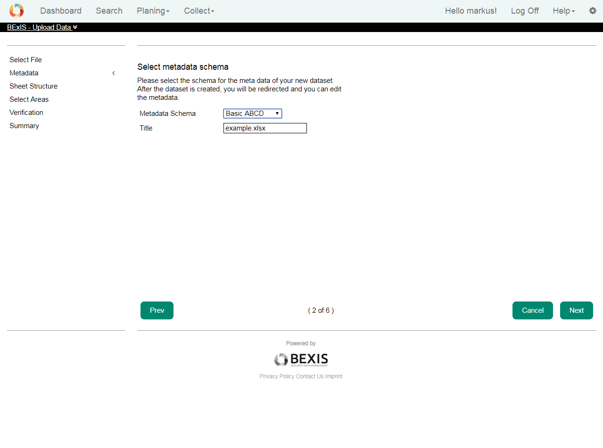

#### 3.3 Select Areas

You will see a table that represents the file that you selected during the first step. Here you can select, which part of the file should be used as variables and which parts should be interpreted as data.

For the variables, select a row or one part of a row and click the "Header" button. The selected area should now be highlighted in red. If you are using a BEXIS2 template file there is no need to select the whole header with unit, datatype, etc. Just select the names of the variables.

For the data, you can select multiple rows and click the "Data" button. The selected area should now be highlighted in blue. Please make sure that the data area contains as many columns as the header area. You can skip one or more rows by selecting the area above them, mark it as data, and then select the area below them and mark it as well. You can use the "Expand Selection" button to expand the last data area you selected to the last row of the file. This can be very helpful when working with large datasets.

If you made any mistakes during the selection process just use the "Reset" button to remove all markings and start over.

If you wish to upload data from a different worksheet you can select it from the dropdown-menu and click the "Change Worksheet" button. Please be aware that you can only upload data from one sheet at a time. Once you have selected the header and at least one data area, click the Next Button to proceed to the next step.

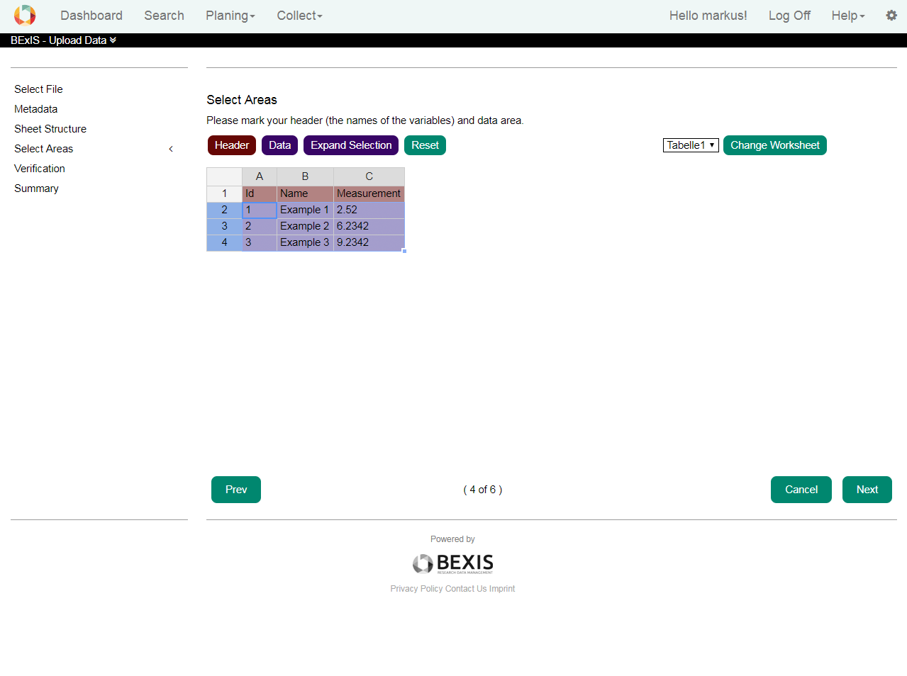

The representation of the data you will see in the table might differ from what you see in Microsoft Excel or similar programs.

Don't worry, your data will be uploaded correctly if you choose the correct datatypes during the next step.

The following differences are known:

*   Dates and times

*   Microsoft Excel users: Dates and times will be displayed as full timestamps, containing both a time and a date.
*   Libre Office users: Dates and times will be displayed as real numbers.

*   Boolean values

*   Libre Office users: Boolean values might be displayed as "0" and "1".

*   Real Numbers

*   Real numbers might be displayed with scientific notation.

#### 3.4 Verification

With this step you can define which units and datatypes your variables are using. The first column of dropdown-menus provides suggestions for attributes that are being used in other datasets and are similar to your variables. If you select one of the suggestions, unit and datatype are automatically adjusted. If you don't wish to use the suggestions, feel free to choose unit and datatype yourself.

The "Validate" button allows you to check if the datatypes you selected are suitable for the data you selected in the previous step. This allows you to recognize errors early and correct your selection. Once you've selected your units and datatypes, click the Next button to proceed.

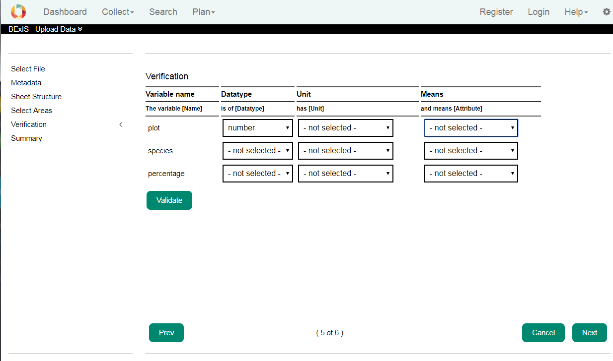

#### 3.5 Summary

The summary step provides an overview of the dataset that is about to be created. When you click the Finish button, datastructure and dataset will be created and the data will be added. This might take a while, depending of the size of your file.

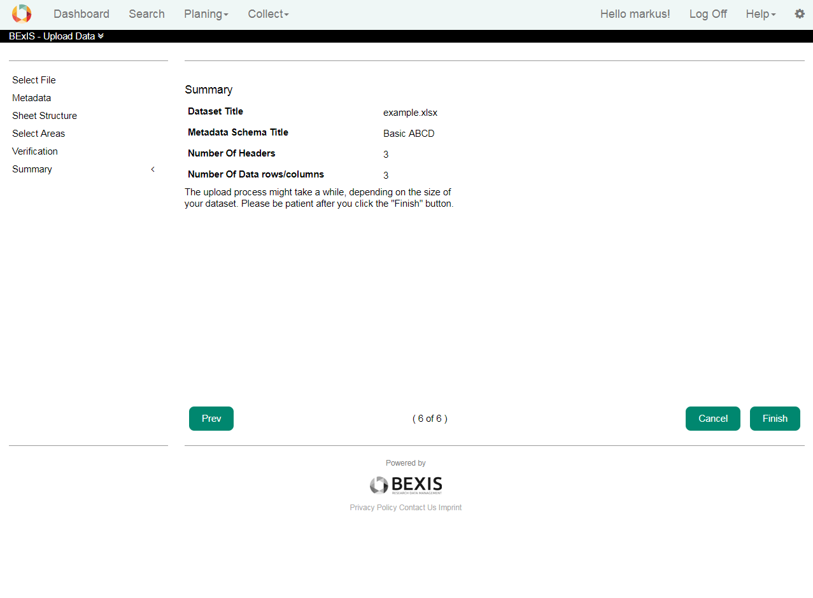

As soon as this process is finished, you will be redirected to your new dataset and can add metadata, view primary data and datastructure, set permissions or publish the dataset.

## 4 Push Big File

Each user has a personal folder on the server where files are stored temporary. On this page you can see the uploaded files. You can delete each file by clicking on the X, or use these files later, when you want to upload data to a dataset.

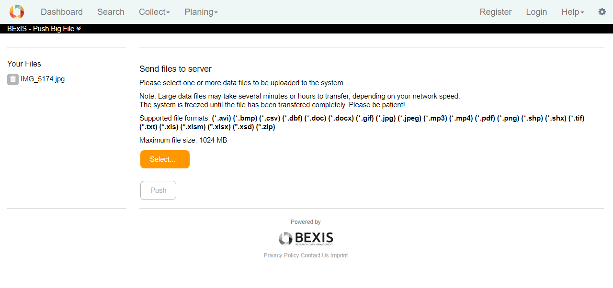

## C: Manual for administrators

### 1 Manage Metadata Structure

Metadata structures (also called schemas or profiles) are typically created and imported by a data manager or administrator of the system. Thus this import function is available under the Setup > Import metadata Structure. The wizard will assist you in importing your metadata structure into the BEXIS2\. A metadata structure must be defined in a XSD schema file.

When importing a metadata schema into BEXIS2, each element of the XSD file(s) is analyzed for its type, name, annotations, attributes, data types, constraints etc. Based on this information a form is automatically being created. For example, if an element is of data type Date, a date picker UI component will be used in the form. Also all names and descriptions are used exactly as they are in the XSD file(s).

NOTE: There are metadata standards available for almost any domain or type of data. It is good practice to follow one of them in order to ensure interoperability later on. However, although technical possible, most standards are very complex and should not be used as a whole. Users would just be overwhelmed and may need only a small selection of elements to describe their data. Standards are designed to cover a great range of use cases and data managers (in collaboration with their community) should make the effort in defining a set of feasible metadata elements in a profile (XSD file).

IMPORTANT: Please check, whether the XSD schema files have any dependencies to other files. You can find the dependencies in the import or include tags.


The current BEXIS2 system requires all referenced files to be locally available on the server (no URL to external resource). So you may need to store all references first to a local folder, change the schema location path in every file (e.g. ./fileName.xsd) and then upload all files to the server. (See section [Push Big File](#_push_big_file)).

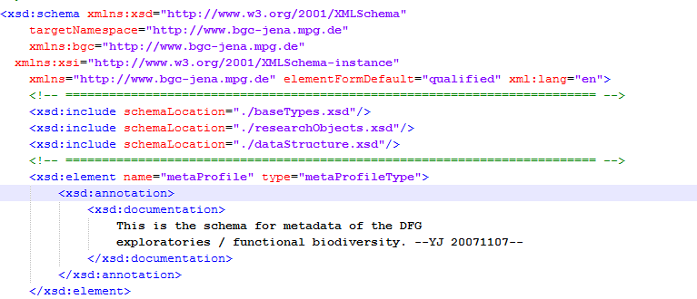

 

Upload a Metadata Structure follows the following steps:

#### 1.1 Select File

In the first step an existing file containing your data needs to be selected. You can either select a XSD file from your local computer or a file that has been uploaded to the server prior to starting the Wizard. You may use the "Push big data to server" function in the Collect menu to upload multiple related XSD files.

Note: Please upload a valid XSD structure. BEXIS2 does not check this kind of validation.

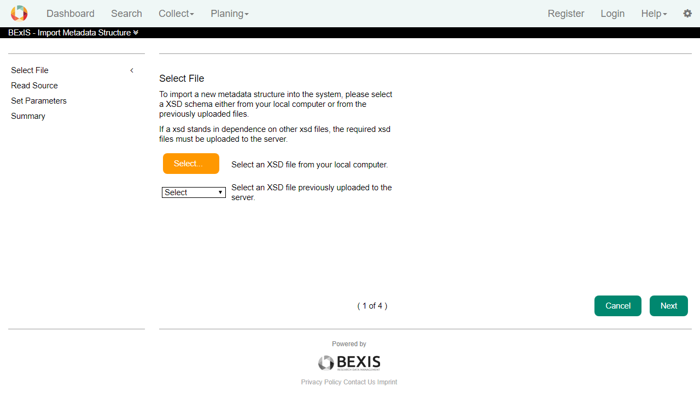 

#### 1.2 Read Source

Please specify a name (i.e. display name) for the new metadata structure. You may also enter a root node if only a part of the XSD is to be used (optional).

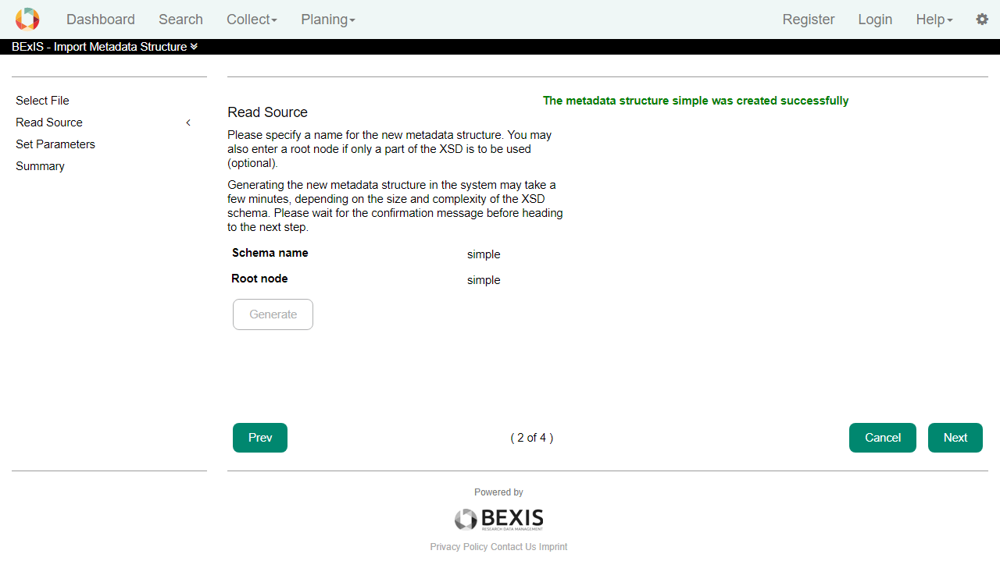  

To find the root node open the XSD Schema file and have a look on the element tags. In the example of ABCD it looks like this.

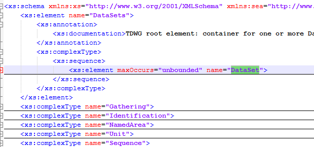  

If no root node is selected then the wizard will automatically select the first element which is a complex type. But it is also possible to define the element "DataSet" as root node and the metadata structure starts from this element. The Name of a metadata structure must be unique and the root node must exist.

#### 1.3 Set Parameters

For the system to handle a dataset at least the title and a description is needed. In this step these two elements, which are typically available in all metadata structures, should be identified and made explicit to the system.

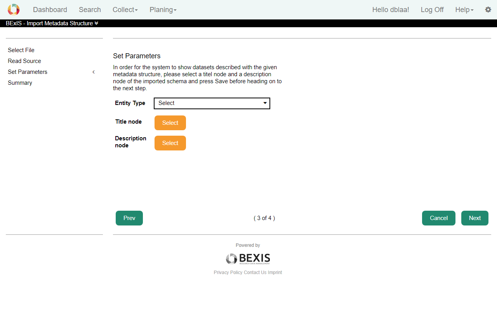 

#### 1.4 Summary

The Summary page is an overview about the created metadata structure.


### 2 Configure dataset links
The reference types and descriptons can be configured under *Workspace/Modules/DCM/EntityReferenceConfig.Xml*. If the system contains also other entity types, which should be not allowed for linking, you can define a whitelist of shown datasets types.

```XML
<config>
<referenceTypes>
    <referenceType description="">collection</referenceType>
    <referenceType description="">based on</referenceType>
    <referenceType description="">child of</referenceType>
    <referenceType description="">parent of</referenceType>
    <referenceType description="">link</referenceType>
</referenceTypes>
<!--Whitelist for entity types. Please configure, if you need to hide entities from the list
<entityTypes>
    <entityType description="">Dataset</entityType>
</entityTypes>-->
</config>

```


[Go to top](#_overview)
