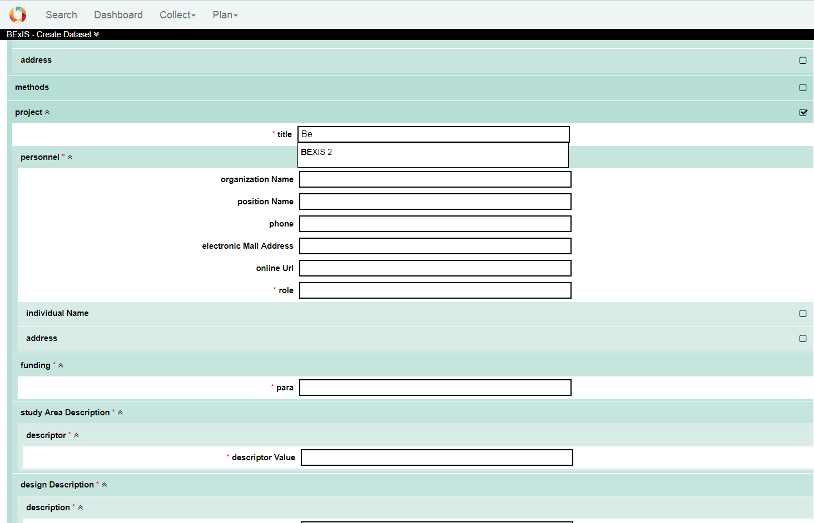
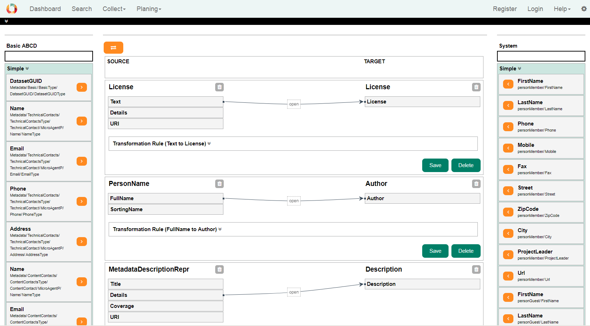
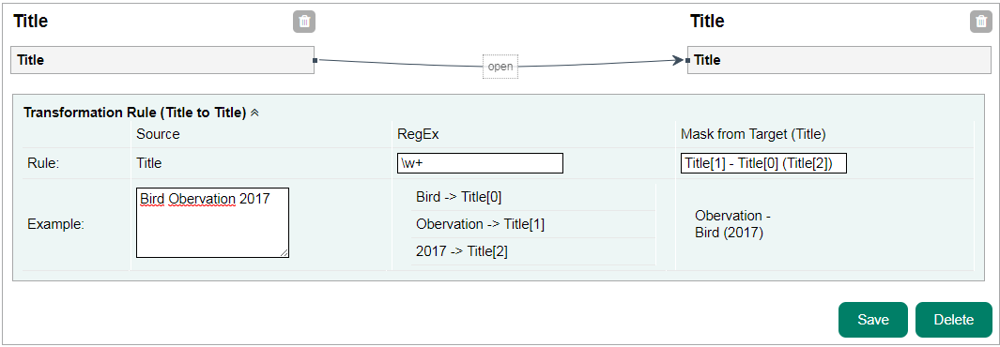
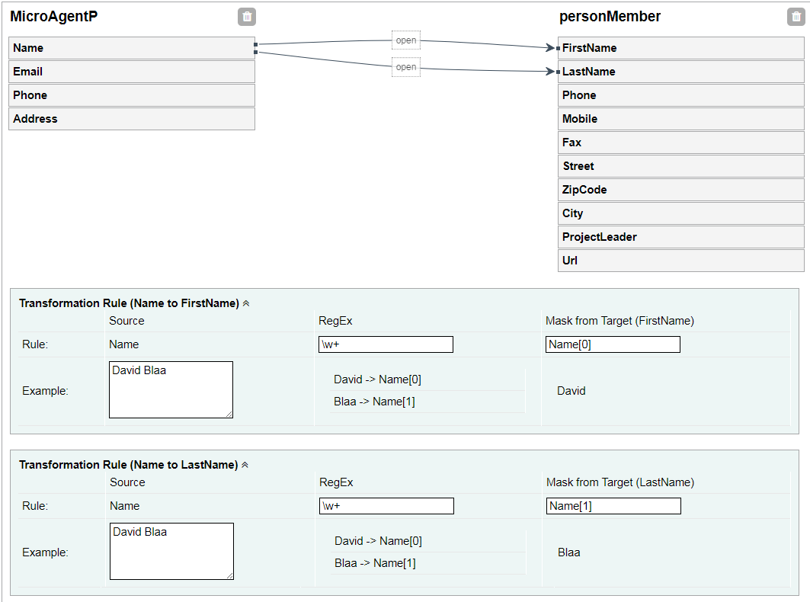

BEXIS 2.13 Data Dissemination

<!-- TOC -->

- [1. Overview](#1-overview)
- [2. Metadata Export](#2-metadata-export)
- [3. Mapping tool](#3-mapping-tool)
	- [3.1. Mapping Overview](#31-mapping-overview)
	- [3.2. Mapping Examples](#32-mapping-examples)
	- [3.3. Create a mapping](#33-create-a-mapping)
	- [3.4. Key overview](#34-key-overview)
- [2. Publishing a Dataset Version](#2-publishing-a-dataset-version)
	- [2.1. Publish](#21-publish)
	- [2.2. GFBIO](#22-gfbio)

<!-- /TOC -->

## 1. Overview

Export Metadata and Manage Metadata Structure are available via Setup (Cog button).  
Export Metadata provides a tool to export metadata to a standard compliant XML file. For every metadata structure in the system there is one tab in the tab strip.  
Manage Metadata Structure provides a tool to set for each metadata structure predefined keys and party types. It explain in this guide under the name Mapping Tool in part 3.

## 2. Metadata Export

The data grid in each tab shows all datasets belonging to the selected metadata structure. Select one or more checkboxes close datasets you would like to export. Clicking on the Export button create the metadata XML files and provides download links in-line.

## 3. Mapping tool

mapping tool in BEXIS2 provides the predefined keys and party types for the metadata structures, which are created in the system.

*   Keys are attributes such as title or description.
*   Party types are defined objects such as persons, institutes, organization or workshops.

for more information about party types see the manual about parties.

Mapping a metadata structure hast two main advantages:

1.  While publishing a dataset, BEXIS2 retrieve information from the metadata. The more keys and party types in the system defined, the better the information can be prepared for publication.
2.  In the BEXIS2 there are party types like people, project, etc.

    In the metadata form, according to the mapping, appropriate results are suggested. If a user encapsulates a person in the metadata form, all matching persons are made available for selection. This simplifies the input of metadata. The following image shows autocomplete for the fild of project title.

### 3.1. Mapping Overview

Mapping tool is accessible through the Manage Metadata Structure by clicking on the arrow buttons. Mapping could be defined to or from the system.

The page of Metadata Structure Mapping is divided into 3 sections. The source is displayed on the left and the target on the right side. All created mappings are displayed in the middle.

Source and target in the left and right side includes two parts: Simple and Complex blocks. First name, last name or full name of a person are examples of Simple elements. A Complex element could be a person. Search box is provided for each side (source or target) seperatly.

Mappings are connections between the source and the target. There are different connection possibilities between the simple attributes. Generally only the connection between two simple attributes is considered.

With the aid of a transformation rule, it is possible to cover a wide range of different cases. A transformation rule consists of a [RegEx](https://msdn.microsoft.com/de-de/library/az24scfc(v=vs.110).aspx) and a mask. With an example you can check the values and the expected result.

### 3.2. Mapping Examples

Following is some examples of one to one, one to many and many to one mapping.

**Example: One to One**

This example creates a connection between two titles. All words are separated by a RegEx and then arranged differently via the mask.

**EXAMPLE: One to Many**

This example creates a connection between a name in one side and the FirstName and the LastName in other side. In the transformation rule, the first and last names are separated from one another by a RegEx and then positioned in the mask via the variable.

**EXAMPLE: Many to One**

This example creates a connection between the FirstName and LastName by a name. Here is no RegEx needed but the mask ordered from both variables.

### 3.3. Create a mapping

1.  Choose a simple or complex element from the source.
2.  Add Element to the middle section by clicking the orange arrow next to the element.
3.  Choose a simple or complex element from the target.
4.  Create the mapping by clicking on the create button
5.  All available simple elements are listed in the mapping container for this mapping. Draw a line by clicking on one simple element from the source side and drag it to a simple element on the target side.
6.  If needed, add RegEx and mask to the transformation rule.
7.  Press on the save button after entering values in the blocks.

### 3.4. Key overview

## 2. Publishing a Dataset Version

Prepare the data is from now available for two brokers and a three data repositories.

*   Brokers:
    *   GFBIO
    *   Pensoft
*   Data Repositories:
    *   GFBIO – Collections
    *   Pangaea
    *   Pensoft

There is limitation to publish a dataset version:  
First of all preparing dataset versions is only possible if the metadata is valid.  
Second is related to the Pensoft. All data prepared for Pensoft must be generated with the GBIF metadata structure.

### 2.1. Publish

Publish a dataset is attainable through the Publish tab on the dataset view.

All available data center are listed in a dropdown. After selcting a data center, system tries to convert the data and the metadata as defined in the submissionConfig.xml. If something fails a warning message will displayed.

There are two types of fails:

1.  The system is not able to convert the data.
2.  Metadata is not valid. In this case you can continue the procedure but the metadata.xml is not valid against the exported xsd schema.

### 2.2. GFBIO

Via the GFBIO portal you can start a submission and publish your dataset. Depending on the subject of the data set, a suitable Data Repository is defined. There are different main Types:

*   Pangaea
*   Collections
*   ENA

Each data repository has different data requirements. BEXIS2 offers an export for Pangea and Collections.

The data for the collections is stored in a zip file includes

1.  Schema - XSD Schema for the metadata
2.  Data.*** - Primary Data
3.  Data structure - Structure of the primary data
4.  Manifest File - General information’s about the Dataset
5.  Metadata - Metadata information’s about the dataset

For the Pangea, the metadata and primary data are stored in a text file.

[Go to top](#_overview)
