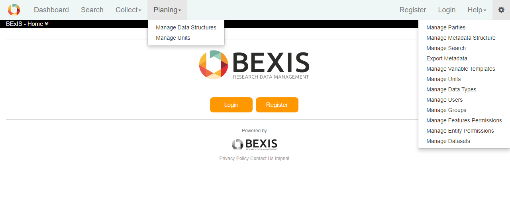
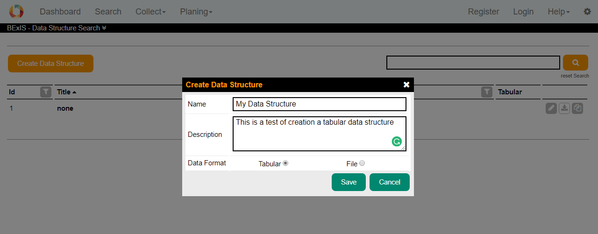
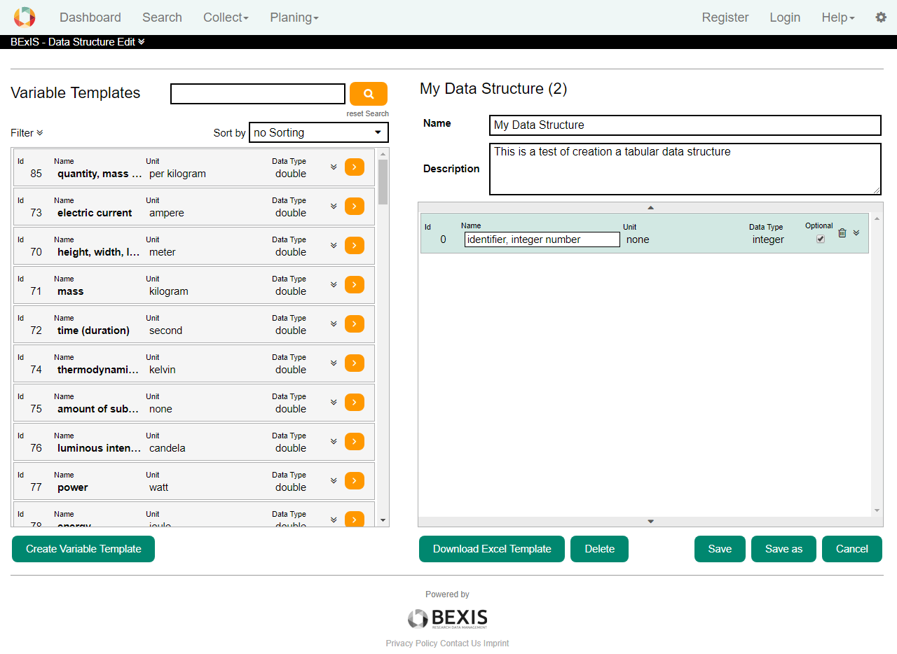
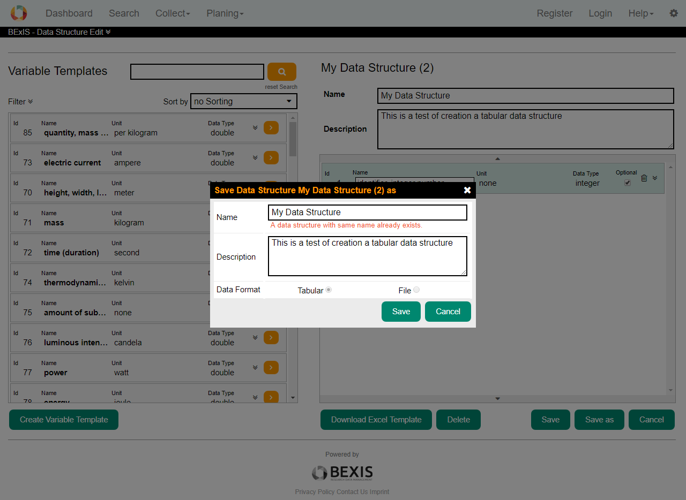
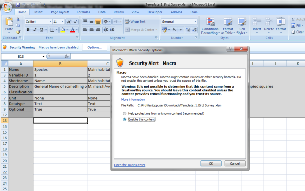
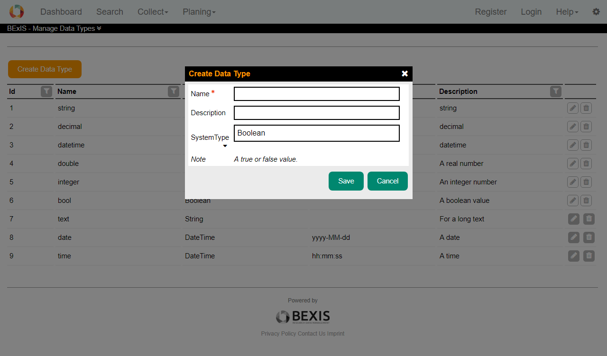
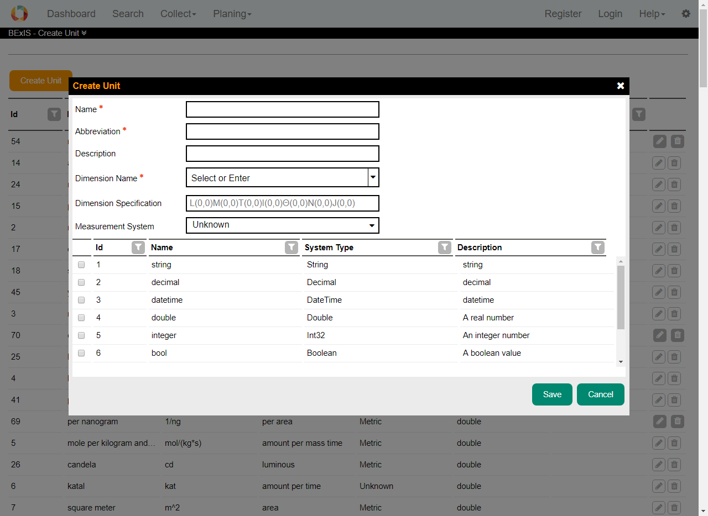
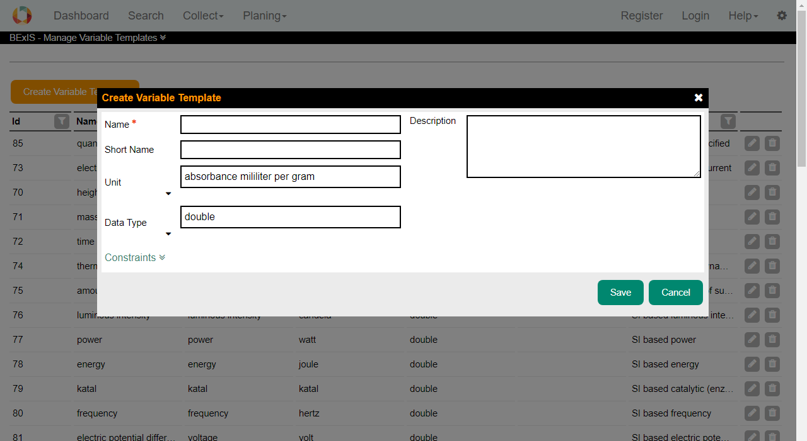

# Data Plannig / Description (v2.13)

<!-- TOC -->

- [A: Overview](#a-overview)

- [B: Manual for users](#b-manual-for-users)
	- [1 Data Structure Manager](#1-data-structure-manager)
		- [1.1 Create Data Structure](#11-create-data-structure)
		- [1.2 Add Variables](#12-add-variables)
		- [1.3 Create a copy of a Data Structure](#13-create-a-copy-of-a-data-structure)
		- [1.4 Download an Excel template](#14-download-an-excel-template)
	- [2 Manage Data Type](#2-manage-data-type)
	- [3 Manage Units](#3-manage-units)
	- [4 Manage Variable Templates](#4-manage-variable-templates)

- [C: Manual for administrators](#c-manual-for-administrators)

<!-- /TOC -->

## A: Overview

In BEXIS2 data is stored and managed as part of a dataset. A dataset may be anything from a single record up to a collection of millions of records and multiple variables. Each dataset may have an individual structure given by the number of variables and their properties. It is up to the user or the data manager of a project to define such *Data Structures*. 

The module was formerly called "Data Planning" since it is good practice to specify the Data Structure before collecting your data in the field or the laboratory. Your data can only be uploaded to the system if there is a corresponding Data Structure already existing.

A Data Structure contains one or more Variables. Each Variable is defined by its Data Type, a Unit, and a unique name and optional identifier for missing values. So defining Data Types and Units would be the first step, if they are not available yet.

 

The system encourages reuse of Variables, as well as Data Types and Units. For example, there should be only one Variable (i.e. Variable Template) for temperature values with a Data type of "float" and measured in degree Celsius (i.e. unit). All datasets containing such temperature measurements should use this Variable Template in their data structure. The advantage of such reuse is not only to avoid redundancy (e.g. different names for the same thing) but is foremost to enable the integration of identical variables across different datasets for large synthesis tasks later on.

## B: Manual for users
## 1 Data Structure Manager

The *Data Structure Manager* is a tool to create, modify and delete Data Structures. Data Structures contain Variables, which are specific instances of Variable Templates. For example, only one Variable Template "Count" is needed to build a Data Structure of multiple similar variables where only the name (e.g. species name) is different. Each Variable uses the same Variable Template (e.g. instances of Count).

It is possible to create Data Structures for Tabular (structured) data such as Excel tables, CSV-Files, etc. and for Files such as images, videos, etc.

#### 1.1 Create Data Structure

Click on Create Data Structure from *Plan > Manage Data Structures*, and then select the Tabular or File option. Fill the fields and click on the Save button. A name for a data structure is required.

 

If a data structure is not already in use by a dataset, by clicking on the edit button you can edit it. In addition to editing the name and description, in the case of Tabular, you can edit also variables.

Delete a data structure is possible through editing.

Download button helps you to download an Excel template.

There is also possible to make a copy from a data structure by clicking on the copy button.

#### 1.2 Add Variables

In the case of Tabular, a data structure usually contains variables. Variables are defined before as Variable Templates. If a data structure is in use, you are not able to add or remove variables.

 

After adding variables, you can rearrange the order of variables by dragging and dropping them. Please note, that the order cannot be changed anymore once a dataset is using this data structure. You may also delete variables from the list.

You can define the requirement for each variable. In the Optional row, if the checkbox is ticked, means that during upload data to a dataset, this variable could be empty.

#### 1.3 Create a copy of a Data Structure

You can create a copy of a data structure, either it is Tabular or File (formerly structured vs. unstructured), by clicking on the _Save as_ button. In that window, the Name is filled with the original one and you need to fill it with a new one.

 

#### 1.4 Download an Excel template

By clicking on the Download button system create an Excel template from the current data structure, which is used when you want to upload data to a dataset (refer to data collection user guide for more details). Save this template on your computer and open it to fill by your data.

As you open this template, you have to enable macros for it. Macros automate frequently-used tasks. Depending on what Microsoft version you use, enable or disable macros is a bit different. But, Macro security settings are generally located in the Trust Center.

Normally, when you open a template file, you have a security warning, that says macros have been disabled. You can click on the Options button and enable this content.

 

### 2 Manage Data Type

With the Data Type Manager you are able to create, modify and delete Data Types. They are required to specify Variable Templates.

To create a Data Type, click on the Create Data Type button. Fill the fields, select a system type and click on the Save button. The Data Type is stored if all information are correct and it is not a duplicate.

Use  for edit and  for delete a data type.

In a typical project scenario, the responsible data(base) manager would have created the most common Data Types and Units.

 

### 3 Manage Units

With the Unit Manager you are able to create, modify and delete Units. Units may be required to define Variable Templates.

To create a Unit, click on the Create Unit button. Fill the fields, select a Measurement System and create or select a Dimension. To create a Dimension enter a Name in the Dimension Name field and edit the Dimension Specification in the pattern "L(0,0)M(0,0)T(0,0)I(0,0)Θ(0,0)N(0,0)J(0,0)". For more information about Dimendion click [here](https://translate.google.de/translate?sl=de&tl=en&js=y&prev=_t&hl=de&ie=UTF-8&u=https%3A%2F%2Fde.wikipedia.org%2Fwiki%2FDimension_%28Gr%25C3%25B6%25C3%259Fensystem%29&edit-text=). For example, a Unit of meter per second (m/s) would represented as "L(1,0)M(0,0)T(0,1)I(0,0)Θ(0,0)N(0,0)J(0,0)".

For a Unit, you could define one or more data types associated with it. By clicking on the Save button, the Unit is stored if all information is correct and it is not a duplicate.

Use  for edit and  for delete a Unit.

 

### 4 Manage Variable Templates

With the Variable Template Manager you are able to create, modify and delete Variable Templates (called Data Attributes in older BEXIS2 versions). Variables are required to create Data Structures.

To create a Variable Template, click on the Create Variable Template button. Fill the fields. Select an associated Unit and Data Type and click on the Save button. The Variable Template is stored if all information are correct and it is not a duplicate.

Use  for edit and  for delete a Variable Template.

 

It is possible to put constraints on Variable Templates, to add constraints click on the link Constrains. You can add a Range, a Pattern and a Domain Constraint to each Variable Template.

*   Range: If the input data is of numeric type, this constraint checks whether the input value falls in the specified range. If the input data is of type string, the range check behaves like a length check, which means the length of the input string should fall in the range. The range has a lower bound and an upper bound, plus two indicators to show whether the boundary values are included in the range. Negate function checks if the value is out of the range!
*   Pattern: takes the value as input and matches it against a pattern to see whether the pattern is found in the input. If so, it returns true; otherwise false. Pattern constraints apply to text values only, for more information on the format click [here](https://en.wikipedia.org/wiki/Regular_expression).
*   Domain: takes the value as input and matches it against each and every domain item in the list. If the value matches one, it stops matching and returns true, which means the value satisfies the constraint. If no match is found it returns false. No duplicate domain item is allowed, although it does not affect the matching procedure described. Domain items can be characters, strings, Booleans or numbers. Their data type is enforced by the associated Variable Template. Using the domain constraint as a tool to model acronyms and similar topics provided that some extra information such as description of each item is available, is supported.
*   Negation: The inversion of the chosen constraint will apply. In fact the result of the constraint is XORed with the negation field. For example, a negated Range Constraint of Min=1 and Max=100 will allow all values outside of this range.

[Go to top](#a-overview)
