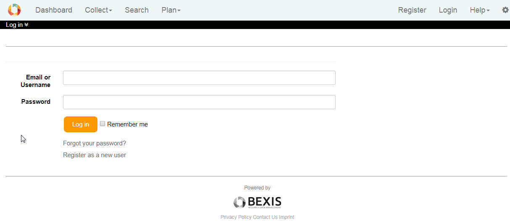
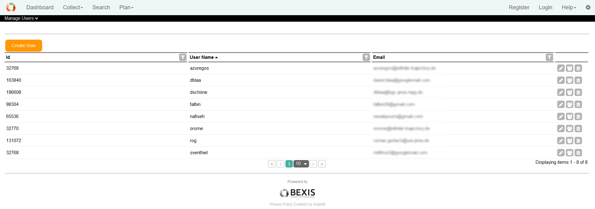
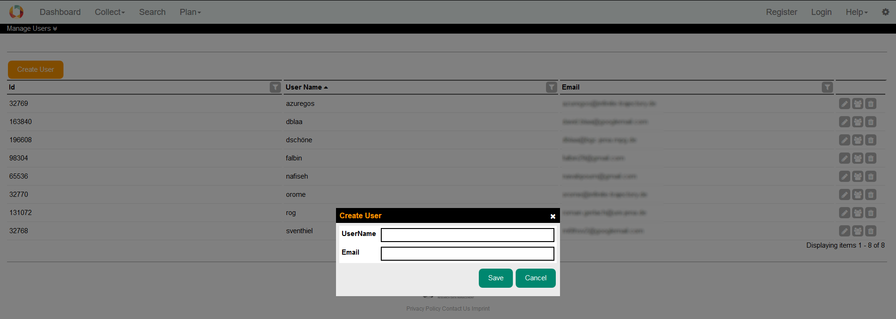
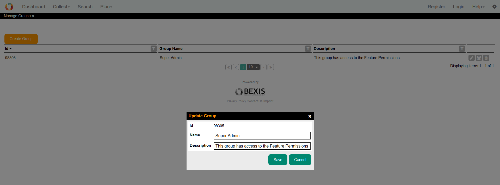
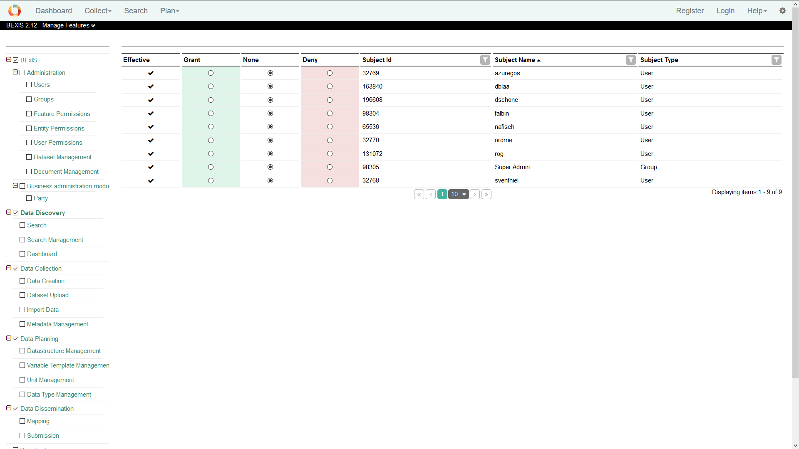
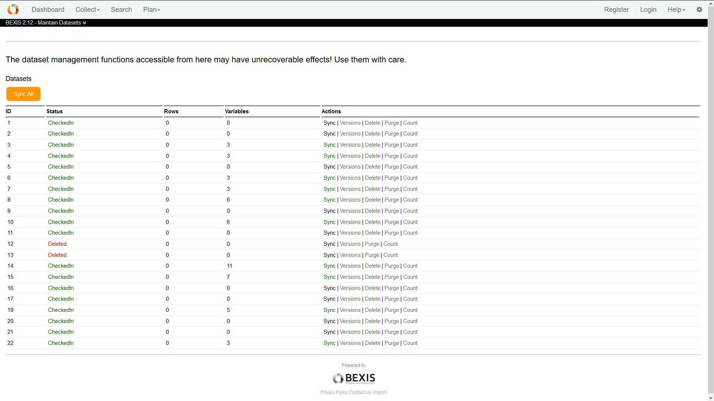

# User and Permission management (v2.13)

<!-- TOC -->
- [A: Overview](#a-overview)

- [B: Manual for users](#b-manual-for-users)

	- [1 Registration](#1-registration)
	- [2 Login](#2-login)
	- [3 Dataset permissions](#....)
	- [4 API Token](#4-api-token)
	
- [C: Manual for administrators](#c-manual-for-administrators)
	- [1 User](#1-user)
		- [1.1 Create a user](#11-create-a-user)
		- [1.2 Edit a user](#12-edit-a-user)
	- [2 Group](#2-group)
		- [2.1. Create a group](#21-create-a-group)
		- [2.2. Edit a group](#22-edit-a-group)
	- [3 Permission](#3-permission)
		- [3.1. Feature Permission](#31-feature-permission)
		- [3.2. Entity Permission](#32-entity-permission)
	- [4 Manage Datasets](#4-manage-datasets)
	

<!-- /TOC -->

## A: Overview

All features and entities (datasets) are secured and managed via a user and permission management. Depending on the instance configuration some features (e.g. search) can be accessible for non-registered users, while others only for authorized users. 
Users can register and the system administrator can assign the appropriate permissions individually or by assigning the user to a permission group. In general, it is possible to add, remove, or modify existing permissions on features and entities (datasets). Each user can also grant permissions on his datasets to others. In addition, it is possible to generate a personal token for authentication to access the application via API calls. 

## B: Manual for users

### 1 Registration

The registration form is accessible through the menu bar. All fields are mandatory and it is also required to agree on the Terms and Conditions and Privacy Policy. To complete the registration process, the email address needs to be confirmed by the user. In most cases, the user will be also asked then to provide further account details (e.g. full name, related project, ...).

### 2 Login

First, press Login button. The system redirects you to the login form and you have to enter your account credentials (user name and password). If the login is successful, you will see Dashboard. Otherwise, the system will notify you about the status and reason why the logon was not successful.

### 3 Dataset permissions

### 4 API Token

In general, the APIs of BEXIS2 are protected by both mechanisms, authentication and authorization. In contrast to the login where usual credential are used, the APIs are using a personalized token for authentication. Within the user menu, each user has the possibility to show her/his own token. Afterwards, that token can be used for the APIs.

 

## C: Manual for administrators
### 1 User

Caution! This part of the system is secured. You may not have access to it.

BEXIS2 provides different features for managing users. These are typically available to system administrators only. Each of them is described in more detail in one of the following subsections.

#### 1.1. Create a user

In addition to the self-registration procedure, user accounts may also be created by an administrator. This feature is available from Setup > Manage Users. Please press the Create button. A modal window will pop up that contains the user creation form. Similar to the self-registration, the system supports you with validation on all information entered.

#### 1.2. Edit a user

Within BEXIS2 you are able to display and modify user information. For security and usability reasons, the system allows modification only for certain parts of the user information. Please go to Setup > Manage Users and press the Edit button of the respective user. You are now able to alter the user information. Changes are committed to the system when you press the Save button.

For any given user memberships to certain groups need to be specified via the tab Membership.

You can change the status easily by (un)select the corresponding checkbox.

## 2 Group

Caution! This part of the system is secured. You may not have access to it.

BEXIS2 provides different features for the managing groups. They are typically available to system administrators only. Each of them is described in more detail in the following subsections.

 

#### 2.1. Create a group

This feature is available from Setup > Manage Groups. Please press the Create button. A modal window will pop up that contains the group creation form. The system supports you with validation on all information entered.

 

#### 2.2. Edit a group

Within BEXIS2 you are able to display and modify group information. Please go to Setup > Manage Groups and press the Edit button of the respective group. You are now able to alter the group information. Changes are committed to the system once you pressed the Save button.

For any given user memberships to certain group need to be specified via the tab Membership.

You can change the status easily by (un)select the corresponding checkbox.

 

### 3 Permission

Caution! This part of the system is secured. You may not have access to it.

Permission is a rule that contains certain security regulations. In general, it is possible to set a rule on both, users and groups.

The security system of BEXIS2 distinguishes between two types of permissions. On the one hand, there are feature permissions, which allow or prohibit the access to well-defined and delimited areas of the application. This type of permissions is working on functional objects (e.g. actions that should be performed) - so called Features. On the other hand, data permissions provide the ability to protect real data (e.g. datasets, research plans and so on).

#### 3.1 Feature Permission

To be able to modify features, Please go to Setup > Manage Feature Permissions. This will bring up a page with a tree on the left side.

Selecting a checkbox in the navigation tree (e.g. Search) will make that feature accessible without authentication (public access). Please use with care!

By clicking a feature name (a node in the tree), the system will show a table on the right side (see below). This table contains all subjects (users and groups) and their feature permission status. You may grant or deny permissions for individual users or groups using the radio buttons. If a permission is not explicitly set (i.e None) permissions are inherited from up level features. Inherited permissions are shown in the first column as effective permissions.

 

#### 3.2 Entity Permission

The security system of BEXIS2 is working on both, functional (features) and non-functional (entities) items. Please go to Setup > Manage Entity Permissions if you like to manage access to entities (datasets).

By selecting a dataset (i.e. a row in the table), the system will show a second table underneath the first one, which contains all subjects (users and groups) and their different data permission statuses regarding the selected dataset. On this page, you are also able to alter the different kinds of data permissions for a selected dataset.

Selecting the checkbox in the first column (i.e. IsPublic) will allow public access to that dataset without any authentication.

 

In general, the system works on six different data permission types:

*   Read: allow/deny read & download access to primary data*   Update: allow/deny manipulation (upload and update) of primary data*   Delete: allow/deny deletion of the whole dataset*   Grant: allow/deny to give permission to other users or groups

### 4 Manage Datasets

Via menu in Setup > Manage Datasets you are able to see a list of Datasets.

In this list you can see the status of each dataset and some useful actions for the maintenance of a dataset.

 

There are two ways to delete a dataset:

Delete: this function tags a dataset to exclude it from nearly all features of the system (e.g. search). But the dataset itself will stay inside the database. So later on you are able to recover the dataset - if needed.

Purge: the dataset will be removed from the system at all (incl. removal of data permissions, metadata and primary data). There is no way to rollback that action.

Note that if you purge a dataset, you cannot recover it at all.

[Go to top](#_overview)
