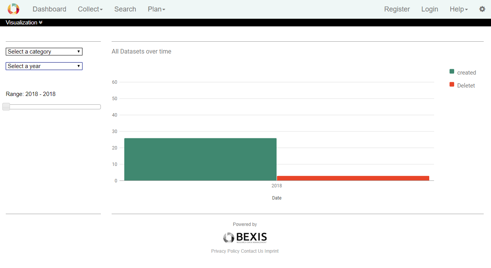
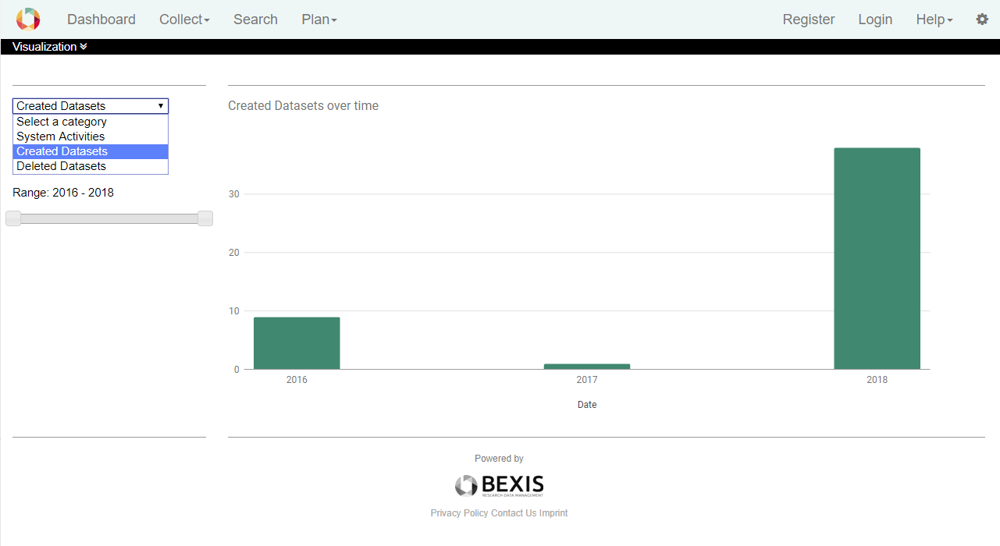
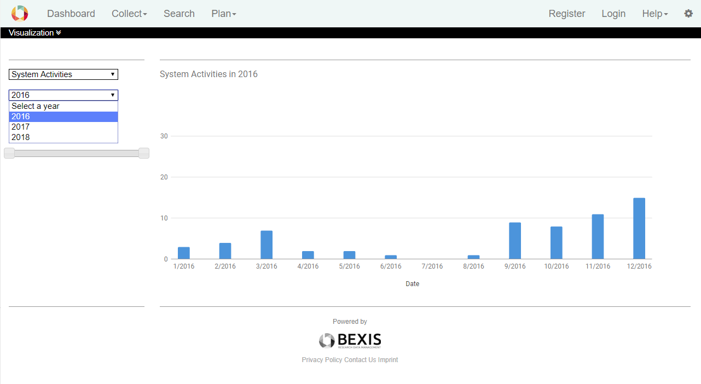
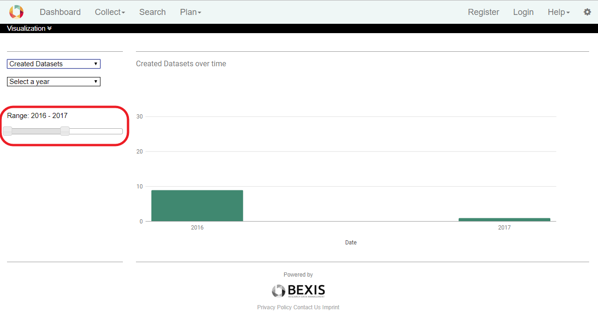

# BEXIS 2.13 - Visualization

<!-- TOC -->

- [1. Overview](#1-overview)
- [2. Select Ranges](#2-select-ranges)
	- [2.1. Select Category](#21-select-category)
	- [2.2. Select Time](#22-select-time)
	- [2.3. Time Slider](#23-time-slider)

<!-- /TOC -->

## 1. Overview

Visualization or in other words the visual representation of data in an easily comprehensible form is the feature of the visualization module for BEXIS2\. User of BEXIS2 is able to get a quick overview of the system behaviour with looking at diagrams. Visualization is accessible through setup in the main menu.  

## 2. Select Ranges

Visualization provides diagrams depend on the selected ranges in different dropdown lists. There is two different lists to control the diagram. One is to select the kind of data and one is to select the time range.  

### 2.1. Select Category

On the first view, when the selector shows "Select a category", you can see a histogram with data of created and deleted datasets. The current version of the BEXIS2 makes you able to see the statistic of system activities, created datasets and deleted datasets over time.  

### 2.2. Select Time

In the drop-down list "Select time”, you can find the past years. By default, the chart displays the data distribution over the entire time from the first activities.  
Select a specific year and see the statistic for only that year, separated in twelve months.  

### 2.3. Time Slider

If you do not like to see all data behaviour from the first activity to the end, you can select a period by the help of the time slider..  

[Go to top](#_overview)